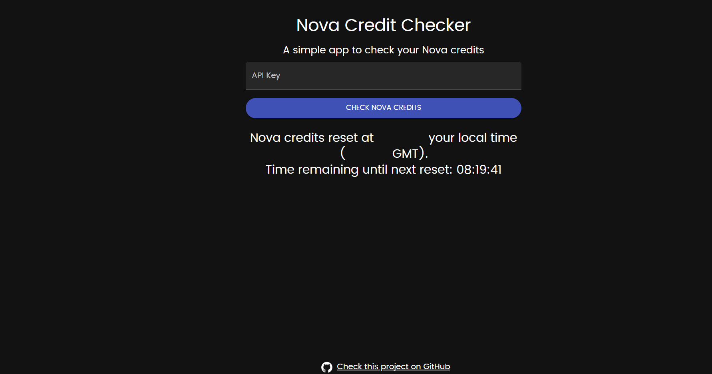

# Nova Credit Checker [DEPRECATED]

## ⚠️ **_Deprecation Notice_** ⚠️

**_This project is no longer maintained or supported, as NovaOSS has been shut down. The code remains here as a reference._**

[Nova Credit Checker](https://novacredits.netlify.app/) is a simple and intuitive app that allows you to check your remaining Nova credits. It's built with React and Material-UI, and it's designed to be user-friendly and secure. You can access the live version of the app [here](https://novacredits.netlify.app/).

## Features

- Check your remaining Nova credits in real-time
- Calculate how many more requests you can make for different services
- Dark mode for a comfortable viewing experience
- Displays the time remaining until the next reset

## Security

Your security is our top priority. When you enter your API key, it is sent directly from your browser to the Nova API over a secure HTTPS connection. This means that your API key doesn't pass through our servers or Cloudflare, and it can't be intercepted by us or any third parties.

We don't store your API key in your browser, and we don't use any third-party scripts that could potentially access it. We also use Content Security Policy (CSP) headers to protect against Cross-Site Scripting (XSS) attacks.

However, please remember that your API key is sensitive information. Don't share it with anyone, and don't send it over unsecured connections. If you believe your API key has been compromised, please contact Nova support immediately to have it revoked.

## Installation

1. Clone this repository: `git clone https://github.com/aaxyat/nova-credits.git`
2. Install the dependencies: `npm install`
3. Start the app: `npm start`

## Contributing

We welcome contributions from the community. If you'd like to contribute, please fork this repository, make your changes, and submit a pull request. We'll review your changes and merge them if they're a good fit.

## License

This project is licensed under the MIT License. See the [LICENSE](LICENSE) file for details.

## Support

If you're having issues with this project, please let us know. We're always here to help.
